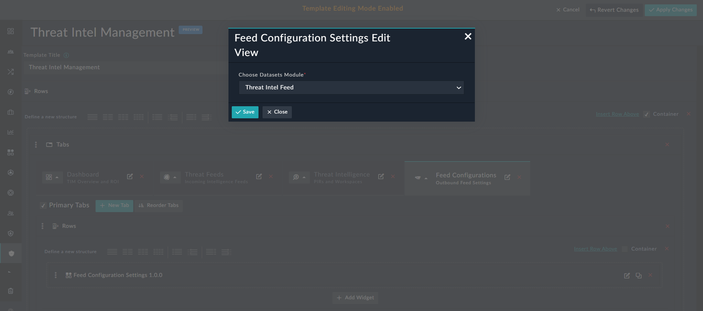
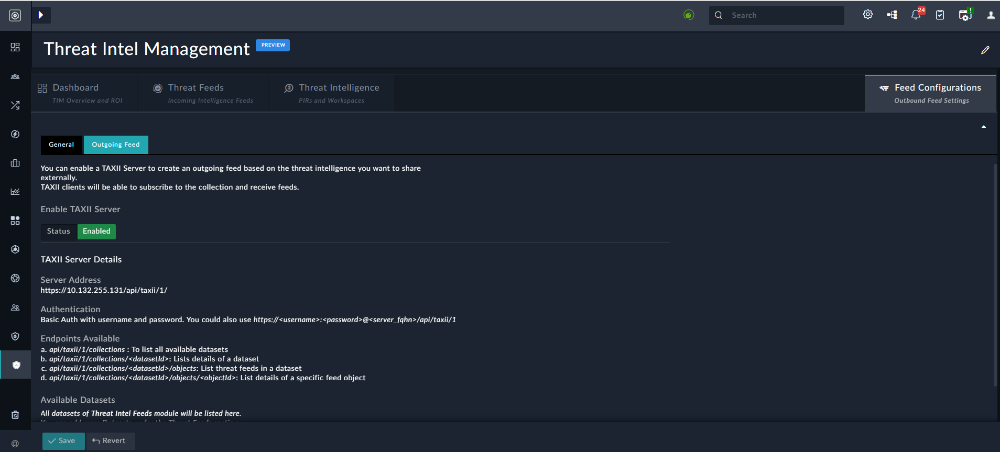
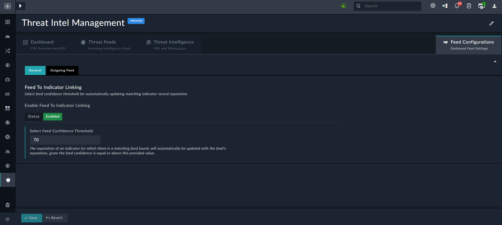

# Feed Configuration Settings

Configures feeds to be consumed by modules. An example of using the feed configuration settings widget would be adding this widget to the **Feed Configurations** tab of the `Threat Intel Management` page, which you could use to configure feeds to be consumed by threat intel module.    

## Version Information

**Version**: 1.1.0

**Certified**: Yes

**Publisher**: Fortinet  

**Compatibility**: 7.2.0 and later  

**Applicable**: Listing views

## Feed Configuration Settings Views

**Feed Configuration Settings Edit View**:

**Feed Configuration Settings - Threat Intel Management page**:

Once you add the Feed Configuration Settings widget, you will see the following on the **Feed Configurations** tab of the `Threat Intel Management` page: 

The **Outgoing Feed** tab allows you to configure standard ways to share threat feeds data. Ensure **Enabled** is clicked on the **Outgoing Feed** tab and then configure a TAXII server so that any other platform having STIX/TAXII capabilities can consume this data.

In the `Available Datasets` section, contains a list of all datasets of the Threat Intel Feeds module. You can click the **JSON** or **CSV** icons to export the threat feeds in the JSON format or the CSV format respectively. You can use the exported threat feeds for consumption in other use cases.

On the **General** tab in the **Feed Configurations** page, you can configure the feed confidence threshold to automatically update the matching indicator record reputation. In this case, the reputation of an indicator that has a matching feed gets automatically updated with the reputation of the feed, provided the confidence of the feed is equal or above to the value specified in the **Selected Feed Confidence Threshold** field (70% in our example):  

## Feed Configuration Settings

Provide the following details to customize the Feed Configuration Settings widget to suit your requirements:

| Fields            | Description                              |
| ----------------- | ---------------------------------------- |
| Threat Intel Feed | Select the module that you want to use for consuming feeds. For example, Threat Intel Feed. |
